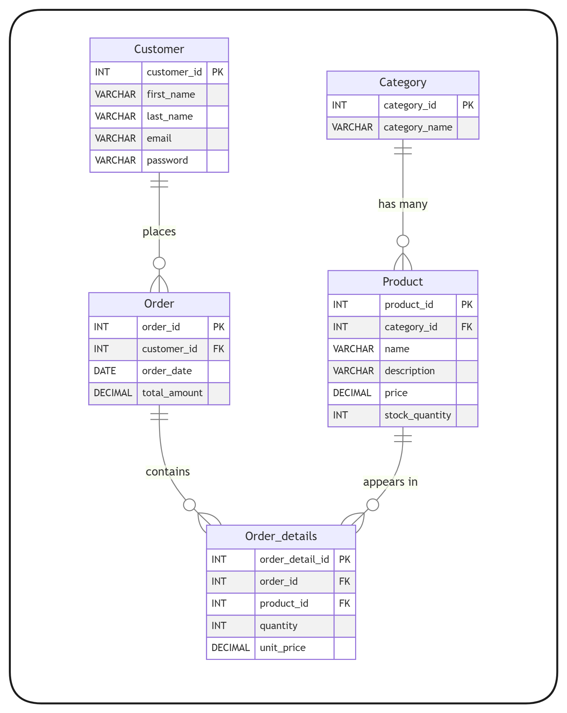

# 📦 E-Commerce Architecture & Database Design

A clean, scalable **database-first foundation** for a sample E-Commerce system.
This repository contains the **ERD**, **full SQL schema**, and a set of **ready-to-run analytical queries** used in real-world products.

---

## ✅ Contents

- ERD showing all entities and relationships
- SQL schema (tables + constraints + indexes)
- Analytical queries for revenue, top products, and high-value customers

---

## 📁 Project Structure

```
docs/
├── erd/
│   └── ERD.png
├── db-schema/
│   └── schema.sql
├── queries/
│   ├── daily_revenue.sql
│   ├── monthly_top_products.sql
│   └── customers_over_500.sql
├── diagrams/
└── notes.md
```

---

## 🧩 Entities

- Category
- Product
- Customer
- Order
- Order_details

---

## 🔗 Relationships

- **Category (1) → (Many) Product**
- **Customer (1) → (Many) Order**
- **Order (1) → (Many) Order_details**
- **Product (1) → (Many) Order_details**

---

## 🗂 ERD



---

## 🧱 Database Schema

Schema file: `docs/db-schema/schema.sql`

```sql
-- CATEGORY
CREATE TABLE Category (
    category_id     INT PRIMARY KEY,
    category_name   VARCHAR(100) NOT NULL
);

-- PRODUCT
CREATE TABLE Product (
    product_id      INT PRIMARY KEY,
    category_id     INT NOT NULL,
    name            VARCHAR(150) NOT NULL,
    description     TEXT,
    price           DECIMAL(10,2) NOT NULL,
    stock_quantity  INT NOT NULL,
    CONSTRAINT fk_product_category
        FOREIGN KEY (category_id)
        REFERENCES Category(category_id)
        ON DELETE CASCADE
);

-- CUSTOMER
CREATE TABLE Customer (
    customer_id     INT PRIMARY KEY,
    first_name      VARCHAR(100) NOT NULL,
    last_name       VARCHAR(100) NOT NULL,
    email           VARCHAR(150) NOT NULL UNIQUE,
    password        VARCHAR(255) NOT NULL
);

-- ORDER
CREATE TABLE `Order` (
    order_id        INT PRIMARY KEY,
    customer_id     INT NOT NULL,
    order_date      DATE NOT NULL,
    total_amount    DECIMAL(10,2) NOT NULL,
    CONSTRAINT fk_order_customer
        FOREIGN KEY (customer_id)
        REFERENCES Customer(customer_id)
        ON DELETE CASCADE
);

-- ORDER DETAILS
CREATE TABLE Order_details (
    order_detail_id INT PRIMARY KEY,
    order_id        INT NOT NULL,
    product_id      INT NOT NULL,
    quantity        INT NOT NULL,
    unit_price      DECIMAL(10,2) NOT NULL,
    CONSTRAINT fk_orderdetails_order
        FOREIGN KEY (order_id)
        REFERENCES `Order`(order_id)
        ON DELETE CASCADE,
    CONSTRAINT fk_orderdetails_product
        FOREIGN KEY (product_id)
        REFERENCES Product(product_id)
        ON DELETE CASCADE
);
```

---

## 📊 Reporting Queries

### 📅 Daily Revenue
**File:** `docs/queries/daily_revenue.sql`

```sql
SELECT
  o.order_date,
  SUM(od.quantity * od.unit_price) AS daily_revenue
FROM `Order` o
JOIN Order_details od ON od.order_id = o.order_id
WHERE o.order_date = :target_date
GROUP BY o.order_date;
```

---

### 📈 Monthly Top-Selling Products
**File:** `docs/queries/monthly_top_products.sql`

```sql
SELECT
  p.product_id,
  p.name,
  SUM(od.quantity) AS total_sold,
  SUM(od.quantity * od.unit_price) AS total_revenue
FROM `Order` o
JOIN Order_details od ON od.order_id = o.order_id
JOIN Product p ON p.product_id = od.product_id
WHERE EXTRACT(MONTH FROM o.order_date) = :month
  AND EXTRACT(YEAR  FROM o.order_date) = :year
GROUP BY p.product_id, p.name
ORDER BY total_sold DESC;
```

---

### 💲 Customers Who Spent Over $500
**File:** `docs/queries/customers_over_500.sql`

```sql
SELECT
  c.customer_id,
  c.first_name,
  c.last_name,
  SUM(o.total_amount) AS total_spent
FROM Customer c
JOIN `Order` o ON o.customer_id = c.customer_id
WHERE o.order_date >= CURRENT_DATE - INTERVAL '1 month'
GROUP BY c.customer_id, c.first_name, c.last_name
HAVING SUM(o.total_amount) > 500
ORDER BY total_spent DESC;
```

---

## ✨ Author
Ahmed Hany
